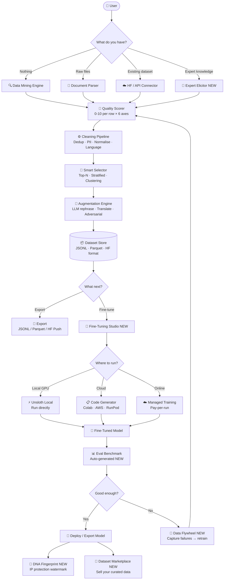

# AI Data Miner — Full Implementation Plan v2

> **Core thesis**: The only platform where raw internet → fine-tuned model happens in one UI, with zero code required.

---

## High-Level Pipeline



---

## The 8 Market-First Features Nobody Has Built Yet

These are features with **zero direct competitors** as of 2026. Each one is a revenue driver on its own.

---

### 🔥 Feature 1 — Fine-Tuning Studio (Module 6)
**The ask**: Data → model in one platform, no code required.

This is the platform's **most important differentiator**. Every other tool stops at "export JSONL." We go all the way to a working fine-tuned model.

#### Sub-components:

**A. Model Browser**
- Search and download any model from HuggingFace Hub (Llama 3, Mistral, Phi-3, Qwen 2.5, Gemma 2, DeepSeek, etc.)
- Shows: parameter count, VRAM requirement, license, recommended LoRA config
- One-click download to local `models/` folder

**B. Visual Hyperparameter Editor**
User drags sliders / types numbers, never touches code:

| Parameter | UI Control | Default |
|---|---|---|
| Base model | Dropdown | Llama-3.2-3B |
| LoRA rank (r) | Slider 4–256 | 16 |
| LoRA alpha | Slider 8–512 | 32 |
| LoRA dropout | Slider 0–0.1 | 0.05 |
| Learning rate | Number field | 2e-4 |
| Batch size | Slider 1–32 | 4 |
| Gradient accumulation | Slider 1–16 | 4 |
| Epochs | Slider 1–10 | 3 |
| Max seq length | Slider 512–8192 | 2048 |
| Optimizer | Dropdown | adamw_8bit |
| Scheduler | Dropdown | cosine |
| Target modules | Checkboxes | q,k,v,o proj |
| Quantization | Toggle | 4-bit QLoRA |
| Warmup ratio | Slider | 0.03 |
| Dataset format | Dropdown | Alpaca/ShareGPT/ChatML |
| Output dir | Text field | ./output |

**C. Code Generator**
One button → generates complete, runnable Python script for:
- **Google Colab** (with `!pip install` cell, free T4 compatible)
- **RunPod** (Docker-ready template)
- **AWS SageMaker** (job script + config)
- **Local Unsloth** (direct execution)
- **Axolotl YAML** config file
- **LLaMA-Factory** config

The code is 100% copy-paste ready. No modifications needed.

**D. Local Runner** (Phase 3)
If user has GPU, run Unsloth directly from the UI. Shows live:
- Training loss curve
- Learning rate schedule
- GPU VRAM usage
- ETA to completion
- Sample generations every N steps

**Generated Colab code example:**
```python
# ═══════════════════════════════════════════
# Generated by AI Data Miner — Fine-Tuning Studio
# Model: unsloth/Meta-Llama-3.1-8B-Instruct
# Dataset: your_dataset.jsonl (4,231 rows)
# Estimated time: ~45 min on T4 GPU
# ═══════════════════════════════════════════

!pip install "unsloth[colab-new] @ git+https://github.com/unslothai/unsloth.git"

from unsloth import FastLanguageModel
import torch

model, tokenizer = FastLanguageModel.from_pretrained(
    model_name = "unsloth/Meta-Llama-3.1-8B-Instruct",
    max_seq_length = 2048,
    dtype = None,
    load_in_4bit = True,
)

model = FastLanguageModel.get_peft_model(
    model,
    r = 16,
    target_modules = ["q_proj","k_proj","v_proj","o_proj",
                      "gate_proj","up_proj","down_proj"],
    lora_alpha = 32,
    lora_dropout = 0.05,
    bias = "none",
    use_gradient_checkpointing = "unsloth",
    random_state = 3407,
)

# ... [full training loop auto-generated]
```

---

### 🧬 Feature 2 — Synthetic Data DNA Fingerprinting
**Problem nobody solved**: You spend weeks curating a premium dataset. Someone downloads it, strips the metadata, relabels it, and sells it as their own. You have no recourse.

**The solution**: Before export, we embed an invisible **cryptographic watermark** into the text patterns of your dataset — at the statistical level, not a visible tag. This watermark survives:
- Reformatting (JSONL → Parquet → CSV)
- Re-ordering rows
- Minor text edits
- Stripping metadata

**How it works**:
- Uses statistical steganography: slightly prefer certain synonym choices, sentence structures, punctuation patterns during augmentation
- The pattern is derived from a hash of your user ID + dataset ID
- We provide a **Verifier API**: paste any dataset, we tell you if it contains your fingerprint
- Patent-pending territory. Nobody in the LLM data space has this.

**Business impact**: Becomes a legal weapon for dataset IP protection. Enterprises will pay $500+/month just for this feature.

---

### 🔄 Feature 3 — Data Flywheel Engine
**Problem**: Fine-tuning is not a one-time event. Every time your model fails in production, that's a training signal you're throwing away.

**The solution**: Deploy our lightweight SDK alongside your model. Every time the model:
- Gets a thumbs-down from a user
- Produces an output that fails automated evals
- Gets corrected by a human

→ That interaction is automatically captured, scored, and added to a **retraining queue**. When the queue hits N rows, trigger a new fine-tuning run automatically.

This is the **Netflix recommendation engine equivalent** for LLMs. The model gets smarter every day it runs in production.

**Implementation**:
- Lightweight Python SDK: `from aidataminer.flywheel import capture`
- REST webhook for any inference endpoint
- Dashboard showing flywheel velocity (rows/day entering queue)
- Auto-trigger retraining when queue hits threshold

**Business impact**: Turns a one-time tool into an always-on subscription. Customers cannot churn without losing their model's accumulated intelligence.

---

### ⚔️ Feature 4 — Adversarial Red-Team Dataset Generator
**Problem**: You fine-tune a model, it looks great on benchmarks, then fails embarrassingly on edge cases in production.

**The solution**: After collecting your training data, our system automatically generates **adversarial variants**:
- Jailbreak attempts against your domain
- Edge-case inputs that probe model boundaries
- Contradictory instructions
- Prompt injection attempts
- Ambiguous phrasing that exposes brittleness

These become training rows where the **correct response is to handle the edge case gracefully**. Your model learns robustness from day one.

**Nobody else generates domain-specific red-team data automatically. Red-teaming is currently a $50k/project manual consulting service.**

---

### 🧠 Feature 5 — Expert Knowledge Elicitor
**Problem**: The best training data lives in domain experts' heads, not on the internet. A cardiologist, a tax attorney, a quant trader — their knowledge is irreplaceable but unstructured.

**The solution**: Record an expert for 30 minutes (audio/video/text transcript). Our pipeline:
1. Transcribes and segments their speech
2. Identifies implicit knowledge patterns ("when X happens, you do Y because Z")
3. Generates hundreds of instruction-response pairs from their reasoning
4. Expert reviews and approves in a simple UI
5. Dataset is ready for fine-tuning

**Business impact**: This is how you sell to hospitals, law firms, financial institutions, and defense contractors. Nobody can replicate this with web scraping.

---

### 📊 Feature 6 — Auto-Eval Benchmark Generator
**Problem**: After fine-tuning, how do you know if your model is actually good? Existing benchmarks (MMLU, HumanEval) measure generic capability, not your specific domain.

**The solution**: From your training data, we automatically generate a **held-out evaluation benchmark** — questions your model should answer well, scored automatically. You get:
- Domain-specific accuracy score
- Comparison against the base model
- Regression detection (did the new fine-tune make anything worse?)
- Side-by-side output comparison UI

**This is the missing piece between "I ran training" and "I have a better model."**

---

### 🛒 Feature 7 — Dataset Marketplace
**Problem**: Every company is curating the same type of data independently, wasting millions of hours.

**The solution**: Built-in marketplace where users can:
- **Sell** their curated, scored, fingerprinted datasets
- **Buy** domain-specific datasets (medical, legal, financial, code, multilingual)
- **License** datasets (one-time, subscription, per-row)
- Revenue split: 70% creator / 30% platform

**Business impact**: Network effects. As more users contribute, the marketplace becomes the primary reason to use the platform. Comparable to what Hugging Face Hub is — but with quality scores, verified provenance, and instant fine-tuning integration.

---

### 🔬 Feature 8 — Training Data Poison Detector
**Problem**: Importing datasets from the internet or HuggingFace Hub is a security risk. Poisoned datasets can embed backdoor triggers that cause models to behave maliciously on specific inputs.

**The solution**: Before any dataset enters the pipeline, scan it for:
- Statistical anomalies that suggest injected patterns
- Rare trigger tokens with suspicious co-occurrence patterns
- Known backdoor signatures from published research
- Toxicity spikes in specific instruction patterns
- Semantic outliers (rows that are statistically inconsistent with the rest)

**This is a compliance and enterprise sales requirement, not a nice-to-have.** Any enterprise deploying models in regulated industries (finance, healthcare, defense) needs this.

---

## Full Module Map (All 8 Modules)

| # | Module | Phase | Unique? |
|---|---|---|---|
| 1 | Data Mining Engine | P1 | Solid |
| 2 | Quality Scorer | P1 | Competitive edge |
| 3 | Cleaning Pipeline | P1 | Table stakes |
| 4 | Smart Selector + Export | P1 | Good |
| 5 | Augmentation Engine | P2 | Available in pieces elsewhere |
| **6** | **Fine-Tuning Studio** | **P2** | **🔥 Nobody has end-to-end** |
| **7** | **Data Flywheel Engine** | **P3** | **🔥 Zero competitors** |
| **8** | **Expert Knowledge Elicitor** | **P2** | **🔥 Zero competitors** |
| **9** | **Adversarial Red-Team Gen** | **P2** | **🔥 Manual-only today** |
| **10** | **Auto-Eval Benchmark Gen** | **P2** | **🔥 Completely missing** |
| **11** | **Dataset Marketplace** | **P3** | **🔥 HF has no quality layer** |
| **12** | **DNA Fingerprinting** | **P3** | **🔥 Patent territory** |
| **13** | **Poison Detector** | **P2** | **🔥 Zero consumer tools** |

---

## Revised Execution Phases

### Phase 1 — CLI MVP (Weeks 1–4)
**Goal**: Prove the core works. Get 10 users.
- Modules 1–4: crawl → score → clean → export JSONL
- `aidataminer run <url|file|hf-name>` — one command, full pipeline
- No UI. No database. Pure Python.

**Stack**: Python, Typer, trafilatura, pdfplumber, pandas, sentence-transformers, datasketch, ftfy, presidio

---

### Phase 2 — Web App + Fine-Tuning Studio (Weeks 5–16)
**Goal**: Full UI + fine-tuning code generator. $0 charge, collect feedback.
- React + TypeScript frontend (Vite, Shadcn/ui, TanStack Table, Recharts)
- FastAPI backend + Celery + Redis job queue
- PostgreSQL metadata + S3/MinIO file storage
- **Fine-Tuning Studio** (Module 6): model browser + hyperparameter UI + code generator
- **Expert Elicitor** (Module 8): audio upload → transcript → dataset
- **Red-Team Generator** (Module 9)
- **Auto-Eval Benchmark** (Module 10)
- **Poison Detector** (Module 13)

---

### Phase 3 — Paid Product + Flywheel (Months 3–5)
**Goal**: $5k MRR within 60 days of launch.
- Stripe billing + usage limits
- **Data Flywheel Engine** (Module 7): SDK + webhook + auto-retrain
- **Dataset Marketplace** (Module 11)
- **DNA Fingerprinting** (Module 12)
- Local GPU runner (run Unsloth from UI directly)
- Team workspaces + auth

---

### Phase 4 — Enterprise (Months 6–12)
**Goal**: $500–$5000/month contracts.
- On-premise Docker deployment
- SAML/SSO
- Custom scoring models (train your own judge)
- Audit logs + compliance exports
- API-first access for CI/CD pipelines
- Dedicated Flywheel instances per customer

---

## Business Model (Updated)

| Tier | Price | Key Features |
|---|---|---|
| **Starter** | Free | 50k rows/mo · 5 URLs · Basic scorer · JSONL export · Code generator (read-only) |
| **Pro** | $49/mo | 5M rows · All parsers · Full scorer · Augmentation · Fine-Tune Studio · HF push |
| **Studio** | $149/mo | Everything in Pro + Flywheel SDK + Poison Detector + Red-Team Generator + Eval Benchmark |
| **Enterprise** | $500–5000/mo | On-prem · DNA Fingerprinting · Marketplace seller · Custom judge models · SLA |

---

## Full Tech Stack

### Backend
- **FastAPI** — REST API
- **Celery + Redis** — async job queue (crawl, score, train jobs)
- **PostgreSQL + SQLAlchemy** — metadata, user accounts, dataset registry
- **S3 / MinIO** — dataset file storage
- **WebSockets** — live training progress streaming

### Frontend
- **React + TypeScript + Vite**
- **Shadcn/ui** — component library
- **TanStack Table** — virtual scrolling for 1M+ row datasets
- **Recharts** — score distributions, training loss curves
- **Monaco Editor** — syntax-highlighted generated code view
- **React Query** — server state management

### ML / Scoring
- **sentence-transformers** — embeddings, semantic dedup, clustering
- **faiss-cpu** — vector similarity at scale
- **datasketch** — MinHash LSH near-dedup
- **spaCy** — NER for specificity scoring, PII detection assist
- **presidio** — PII detection + anonymization
- **transformers + torch** — local model inference for judge
- **Unsloth** — fine-tuning engine (local runner)
- **anthropic / openai SDK** — LLM-as-judge + augmentation calls

### Infrastructure
- **Docker + Docker Compose** — local dev
- **Railway / Render** — Phase 2 deploy
- **Kubernetes + HPA** — Phase 4 autoscaling workers
- **nginx** — reverse proxy

---

## Open Questions (Please Answer Before Build)

> [!IMPORTANT]
> 1. **API keys for LLM judge**: Do you have Anthropic or OpenAI key? Determines if Phase 1 uses real LLM scoring or heuristic.
> 2. **Fine-Tuning Studio priority**: Should code generator (Colab export) be in Phase 1 CLI, or wait for Phase 2 web UI?
> 3. **Local GPU runner**: Do you have a GPU machine to test Unsloth local training on? If yes, I can wire it in Phase 2.
> 4. **CLI command name**: `aidataminer`, `adm`, or something else?
> 5. **Marketplace**: Phase 3 or do you want the architecture designed from day 1 so it's easy to add?
